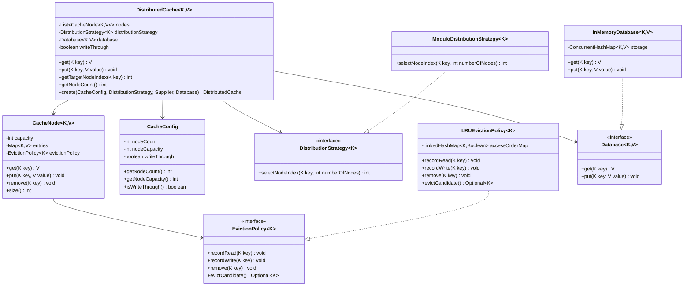

# Distributed Cache Design

## Assumption
This implementation uses write-through behavior on put(key, value) when configured:
- put writes to cache node
- put also updates database

If write-through is disabled, put updates only the cache.

## Class Diagram

## How Data Is Distributed
DistributedCache delegates node selection to DistributionStrategy.
Current strategy is ModuloDistributionStrategy:
- index = floorMod(hash(key), numberOfNodes)

This keeps routing logic outside the cache core so strategies can be replaced.

## How Cache Miss Is Handled
Flow for get(key):
1. Resolve target node via distribution strategy.
2. Try node.get(key).
3. If value is absent, read from database.
4. If database returns value, store it in the same node and return it.

## How Eviction Works
Each node has fixed capacity.
On node.put(key, value):
1. If key is new and node is full, node asks EvictionPolicy for a victim key.
2. Victim is removed from node storage.
3. New key-value is inserted and access metadata is updated.

LRUEvictionPolicy tracks access order using LinkedHashMap in access-order mode.

## Extensibility
The design supports future extensions without changing core workflow:
- DistributionStrategy can be replaced with consistent hashing or map-based routing.
- EvictionPolicy can be replaced with LFU or MRU.
- Database interface allows plugging in any backend.
- CacheConfig allows changing node count and node capacity.
